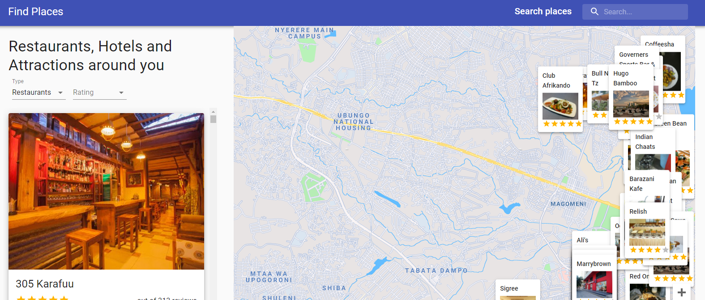

# Find Places App

This is an app that helps a user find places. A user can search for different places such as restaurants, hotels, and places that one can tour in different cities across the world. The app also shows the reviews of such searched places and a link to the trip advisor's page and/or the place's website if any so as to get more details about the place.

# Live Demo
<a href="https://ejokaplaces.netlify.app">Live Demo</a>

## Built With

- ReactJS
- Google Maps API
- Material-UI

## Getting Started

Open your terminal or text editor and use next command

        git clone https://github.com/emmanuelkamala/places-advisor.git

        cd places-advisor
        ### run 'npm install' to install dependencies
        ### npm start

## Opening the app

Then open the browser and enter this link:
http://localhost:3000

After if you want to do any changes please create new branch, after changes open pull request.
Happy coding! 

## Authors

👤 **Author1**

- Github: [emmanuelkamala](https://github.com/emmanuelkamala)
- Twitter: [ejkamala](https://twitter.com/ejkamala)
- Linkedin: [emmanuelkamala](https://linkedin.com/in/emmanuelkamala)

## 🤝 Contributing

Contributions, issues and feature requests are welcome!

Feel free to check the [issues page](issues/).

## Show your support

Give a ⭐️ if you like this project!

## 📝 License

This project is [MIT](lic.url) licensed.
